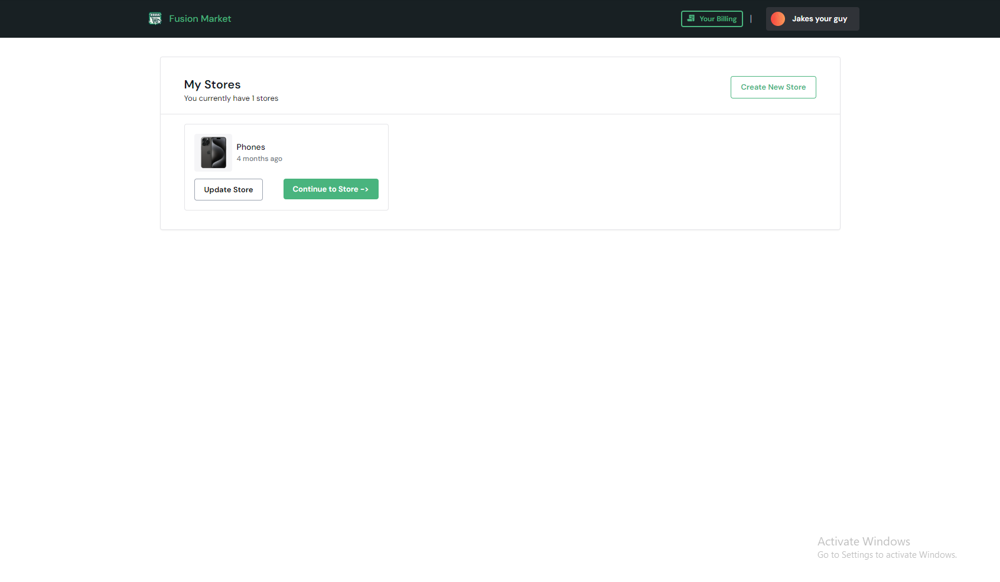
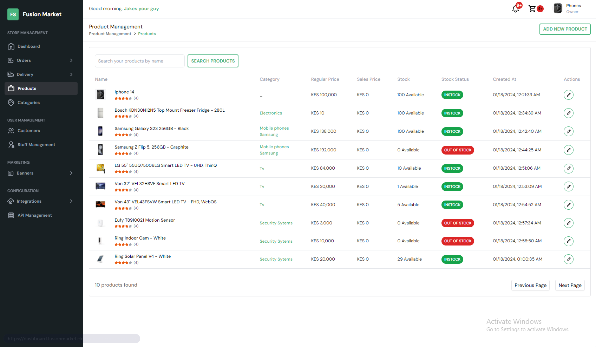

# Store254

### The Next Generation Solution for your Digital Business

Store254 is an e-commerce platform where users can create and manage multiple stores with easy integration through REST APIs for streamlined operations and data synchronization.

Also to get postman collectionyou can find them in docs/postman.

## Screenshots


_Dashboard_


_Reports Section_

## Features

- **Product Management**: Intuitive tools for adding, updating, and organizing your product catalog.
- **Customer Management**: Seamlessly handle customer interactions and cart management.
- **Order Management**: Integrated solution for managing orders and shipments.
- **REST API**: Robust API support for integrating third-party services and enhancing store functionality.
- **Payment Integration**: Seamlessly integrate third-party payment options for secure transactions.

## Database Migrations

### Prerequisites

- [Go](https://golang.org/doc/install)
- [Migrate CLI](https://github.com/golang-migrate/migrate)
- PostgreSQL database (Update `DATABASE_URL` in the Makefile with your database URL).

### Commands

Create a New Migration, Migrate Up, Migrate Down:

```sh
make create name=<migration-name>
make up
make down
```
"# store254" 
"# store254" 
"# store254" 
